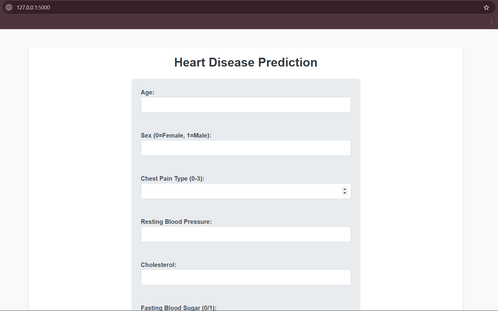
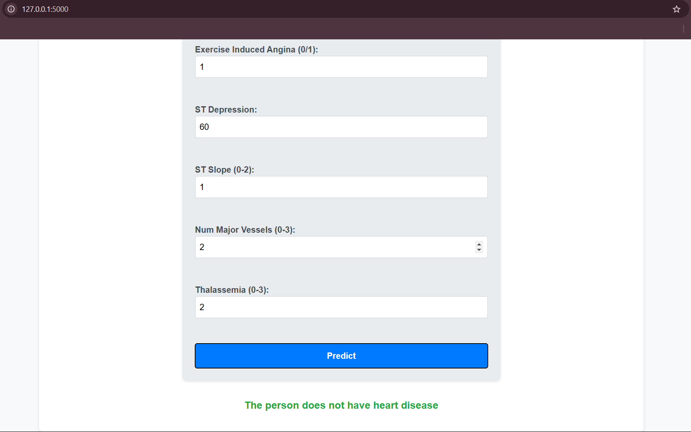

I) Heart Disease Prediction
   ------------------------
  A web-based application powered by machine learning to predict the likelihood of heart disease based on user input. This project utilizes Python, Flask, and Logistic Regression, offering a user-friendly interface for predictions.

II) About the Project:
  ------------------
  This project is designed to assist in predicting heart disease using 13 key medical features, such as age, cholesterol level, and chest pain type. By leveraging Logistic Regression, it provides quick and reliable predictions through a simple web interface.

III) Features:
  ---------
  - Input medical details through a user-friendly form.
  - Real-time prediction using a machine learning model.
  - Visual representation of prediction results.
  - Easy deployment on platforms like Heroku or Render.

IV) Technologies Used:
  ------------------
  - Programming Language: Python
  - Web Framework: Flask
  - Machine Learning: Logistic Regression Algorithm
  - Frontend: HTML, CSS, Bootstrap
  - Visualization: Matplotlib, Seaborn

V) Dataset:
  -------
The dataset used for training the model is from the [Heart Disease Dataset](app/data/heart.csv). It includes 303 samples and 14 attributes (13 features and 1 target variable).

VI) Installation:
  -------------
  Follow these steps to set up the project on VS Code:
  1. Create a folder(name: "HeartDiseasePrediction") in local drive and open it in VS Code.
  In Terminal:
  2. Check python is install or not by typing - "python -- version" OR "python3 --version". If not installed download from "Python.org".
  3. Install Virtual Environment - "pip install virtualenv".
  4. Create a Virtual Environment - "python -m venv venv" if error occurs open the powershell as run as administration type: 1) get-executionpolicy 2) set-executionpolicy allsigned 3) A.
  5. Activate the Virtual Environment - 1) For Windows: "venv\Scripts\activate" 2) For mac: "source venv/bin/activate".
  6. Install Flask - "pip install flask".
  7. Install Additional Libraries: "pip install pandas matplotlib seaborn scikit-learn joblib".
  8. Save some of the requirements: "pip freeze > requirements.txt".
  9. After all codes are writtten run the flask app by: "python folder_name/app.py"

                  OR

   1. Clone the Repository:
   ```bash
   git clone https://github.com/NikhilYS16/heart-disease-prediction.git
   cd heart-disease-prediction
   ```

   2. Create a Virtual Environment:
   ```bash
   python -m venv venv
   # For mac: source venv/bin/activate
   # For Windows: venv\Scripts\activate
   ```

   3. Install Dependencies:
   ```bash
   pip install -r requirements.txt
   ```

   4. Run the Application:
   ```bash
   flask run
   ```

   5. Open your browser and visit `http://127.0.0.1:5000`.

VII) Usage:
   ---------
   1. Input medical details like age, cholesterol level, and chest pain type in the provided form.
   2. Click the "Predict" button to get the result.
   3. The app will display whether the individual is likely to have heart disease.

VIII) Screenshots:
   ---------------
   ## Homepage
   

   ## Prediction Result
   

